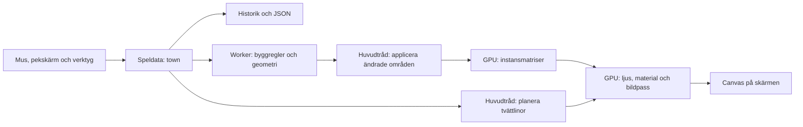
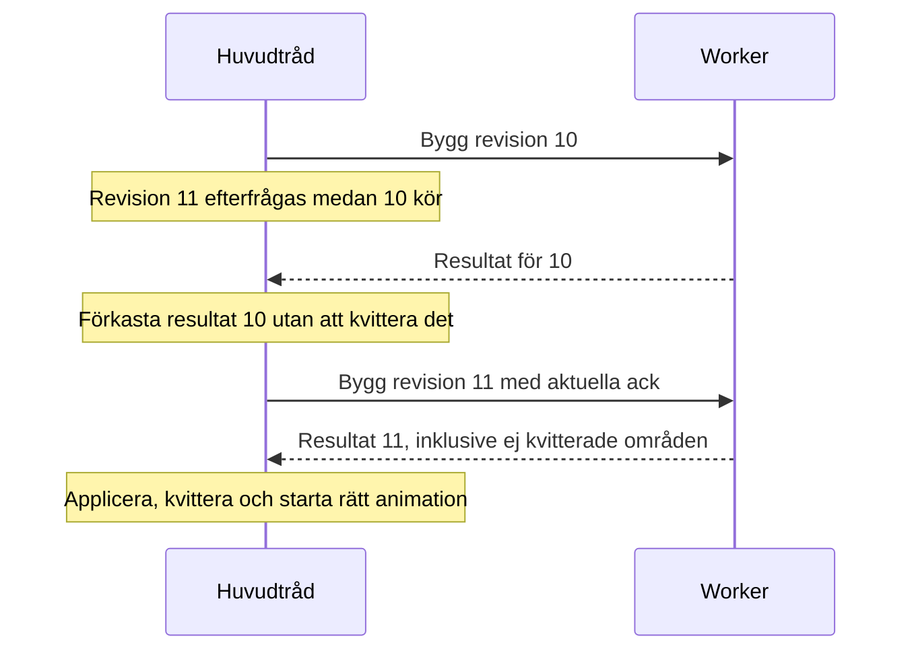
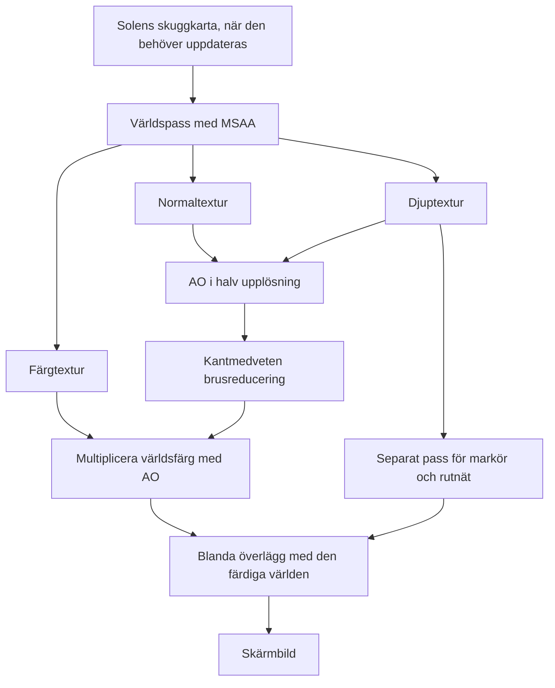

# Riviera inifrån – teknisk beskrivning och tutorial

Den här guiden beskriver koden i Riviera vid commit `d833096`. Den förutsätter att du kan läsa enklare JavaScript, men inga tidigare kunskaper om WebGPU eller 3D-programmering. Kodexemplen är antingen hämtade från implementationen eller tydligt märkta som förenklingar. Filhänvisningar anger också funktionsnamn, så att du kan hitta rätt även när radnummer förändras.

Målet är att du ska kunna följa ett klick hela vägen till bilden, förstå varför systemet är uppdelat som det är och veta var du ska börja när du vill lägga till något.

## Läsordning

1. **Världen och byggandet:** kapitel 1–7. Kör labbet i kapitel 5.
2. **Bilden och GPU:n:** kapitel 8–13. Prova att slå av och på AO och skuggor.
3. **Ändra och felsöka:** kapitel 14–18. Gör en övning i taget.

Innehåll:

- [1. Tre representationer av samma by](#1-tre-representationer-av-samma-by)
- [2. Kör projektet och hitta i koden](#2-kör-projektet-och-hitta-i-koden)
- [3. Rutnät, koordinater och höjder](#3-rutnät-koordinater-och-höjder)
- [4. Från musklick till ändrad värld](#4-från-musklick-till-ändrad-värld)
- [5. Labb: två hus, en gemensam takplan](#5-labb-två-hus-en-gemensam-takplan)
- [6. Workern och inkrementell ombyggnad](#6-workern-och-inkrementell-ombyggnad)
- [7. Hus, tak, landskap och rekvisita](#7-hus-tak-landskap-och-rekvisita)
- [8. Trianglar, attribut och instanser](#8-trianglar-attribut-och-instanser)
- [9. Vad WebGPU och TSL faktiskt gör](#9-vad-webgpu-och-tsl-faktiskt-gör)
- [10. En bildruta genom renderkedjan](#10-en-bildruta-genom-renderkedjan)
- [11. Ljus, skuggor och AO](#11-ljus-skuggor-och-ao)
- [12. Material, vatten och skum](#12-material-vatten-och-skum)
- [13. Animationer och tvättlinor](#13-animationer-och-tvättlinor)
- [14. Sparning och historik](#14-sparning-och-historik)
- [15. Prestanda och mätning](#15-prestanda-och-mätning)
- [16. Praktiska ändringsövningar](#16-praktiska-ändringsövningar)
- [17. Felsökning och viktiga gränser](#17-felsökning-och-viktiga-gränser)
- [18. Testning och publicering](#18-testning-och-publicering)

## 1. Tre representationer av samma by

Byn existerar samtidigt i tre former:

| Representation        | Exempel                                                        | Varför den finns                 |
| --------------------- | -------------------------------------------------------------- | -------------------------------- |
| Speldata              | Ruta 151 har två husvåningar och markhöjd 1,5                  | Enkel att ändra, spara och ångra |
| Härledd geometri      | Trianglar för väggar, tak och klippor samt listor med fönster  | Beskriver vad som ska ritas      |
| GPU-resurser och bild | Vertexbuffertar, instansmatriser, skuggkarta och bildbuffertar | Gör rendering effektiv           |

Om du tar bort ett hus ändrar du speldata. Därefter härleds ny geometri. Till sist uppdateras GPU-resurserna. JSON-filen innehåller därför inga taktrianglar eller fönstermodeller: de kan återskapas från data och regler.



**En worker är också CPU-kod.** Den kör JavaScript i en separat tråd. WebGPU gör inte dagens takplanering eller polygontriangulering. Den uppdelningen är viktig både när du läser koden och när du tolkar mätningar.

## 2. Kör projektet och hitta i koden

Från repots rot, med Node.js 24 och projektets beroenden:

```powershell
npm ci
npm run dev
```

Öppna den adress Vite skriver ut, normalt `http://localhost:5173/`. WebGPU måste fungera i webbläsaren. `init()` i [main.js](../src/main.js) kontrollerar både `navigator.gpu` och att rendererns aktiva backend faktiskt är WebGPU.

För produktionsbygget:

```powershell
npm run build
npm run preview -- --port 4173
```

Öppna då `http://localhost:4173/Riviera/`. Skillnaden i sökväg kommer från [vite.config.js](../vite.config.js).

### Filkartan

| Fil                                                 | Ansvar och bra startpunkt                                              |
| --------------------------------------------------- | ---------------------------------------------------------------------- |
| [main.js](../src/main.js)                           | `init`, `editWork`, `pickWork`, `updateHoverWork`, renderloopen och UI |
| [grid.js](../src/grid.js)                           | `makeGrid`, `inside`, seedad slump och den äldre hamndemon             |
| [state.js](../src/state.js)                         | `serialize`, `deserialize`, `History`                                  |
| [terrain.js](../src/terrain.js)                     | `sculpt`, `cornerHeights`, `terrainPick` och höjdregler                |
| [architecture-view.js](../src/architecture-view.js) | Workerprotokoll, meshuppdateringar, GPU-compute och raycasting         |
| [build.worker.js](../src/build.worker.js)           | Tar emot meddelanden och anropar byggmotorn                            |
| [build-engine.js](../src/build-engine.js)           | `BuildEngine.build`, cache, beroenden och områden                      |
| [cell-builder.js](../src/cell-builder.js)           | Husväggar, grund, fönster, balkonger och takmesh                       |
| [supports.js](../src/supports.js)                   | `supportPlan`: var valv och konsoler har stöd                          |
| [roofs.js](../src/roofs.js)                         | `planRoofs`, `roofPatch`, takfält och nockar                           |
| [terrain-builder.js](../src/terrain-builder.js)     | Terrängytor, sluttningar, trappor, kuststenar och träd                 |
| [hero-builder.js](../src/hero-builder.js)           | Fyrar och parasoll med cafébord                                        |
| [geometry-data.js](../src/geometry-data.js)         | `Batch`, `mergeGeometry`, `packInstances`                              |
| [spatial.js](../src/spatial.js)                     | `SpatialIndex`, `buildBVH`, `intersectBVH`                             |
| [architecture.js](../src/architecture.js)           | Hus-/markmaterial i TSL och bygganimation                              |
| [environment.js](../src/environment.js)             | Vatten, sol, skuggor, AO, redigeringslager och bildpass                |
| [laundry-layout.js](../src/laundry-layout.js)       | Automatiska och manuella fästpunkter, hinderkontroll                   |
| [laundry.js](../src/laundry.js)                     | Gemensam tvättmesh och GPU-rörelse                                     |
| [profiler.js](../src/profiler.js)                   | CPU-tid, riktiga GPU-tidsstämplar och resursstatistik                  |
| [render-resources.js](../src/render-resources.js)   | Versionsberoende frigöring av Three.js-resurser                        |
| [landscape-demo.js](../src/landscape-demo.js)       | Den redigerbara landskapsbyn                                           |

Sök hellre efter ett funktionsnamn än att läsa hela `main.js` från början:

```powershell
rg -n 'editWork|rebuildWork|updateWorldEnvironment' src/main.js
```

## 3. Rutnät, koordinater och höjder

### Rutorna är en graf av fyrhörningar

Varje cell har bland annat följande fält. Detta är ett schematiskt exempel, inte en verklig cell ur sparningen:

```js
{
  id: 151,
  vertices: [12, 38, 90, 44], // index till gemensamma hörn
  points: [[x0, z0], [x1, z1], [x2, z2], [x3, z3]],
  center: [x, z],
  neighbors: [1115, 152, 149, -1]
}
```

`neighbors[e]` är grannen över kanten från hörn `e` till `(e + 1) % 4`. `-1` betyder att kanten ligger vid världens gräns. Hörnens index gör att flera celler kan dela exakt samma hörn, vilket är avgörande för täta möten och stödregler.

`makeGrid()` gör följande på CPU:n vid start:

1. Skapar ett stört, förskjutet punktmönster med seedad slump.
2. Delaunay-triangulerar punkterna med Delaunator.
3. Parar ihop lämpliga granntrianglar till konvexa fyrhörningar; andra trianglar lämnas kvar till nästa steg.
4. Delar polygonerna med kantmittpunkter och centrum. Det ger fyrhörningar även från kvarvarande trianglar.
5. Jämnar ut inre hörn under nio iterationer; yttergränsen hålls still.
6. Matchar gemensamma kanter och bygger grannlistorna.

Seed `81` ger samma cell-ID:n vid varje start. Ändrar du algoritmen eller seedet kan ett gammalt ID börja syfta på en annan plats. Därför är gridet en del av sparformatets kontrakt.

### Tre olika betydelser av höjd

Världen använder X och Z som markplan; Y pekar uppåt. I data anges marken i husvåningars höjdenheter. De fysiska måtten ligger i [palette.js](../src/palette.js):

```js
export const FLOOR = 1.16,
  BASE = 0.4;
```

Markhöjden `0.5` betyder alltså `0.58` i världens Y-led. `TERRAIN_STEP = 0.5` är ett halvsteg i **lagrad höjd**, inte en halv världsenhet.

Husen lagras i en `Map`:

```js
const town = new Map();
town.set(151, [0, 3, 3]);
town.terrain = new Map([[151, [0.5, 1]]]);
```

Det betyder en grund på index 0 och två husvåningar med färgindex 3, på gräs med markhöjd 0,5. `town.terrain` är en extra egenskap på Map-objektet; den ingår inte när man itererar `[...town]`.

| Del                          |           Y-höjd i detta exempel |
| ---------------------------- | -------------------------------: |
| Markens plana ovansida       |                             0,58 |
| Grundens ovansida            |                0,58 + 0,4 = 0,98 |
| Första husvåningens ovansida |               0,98 + 1,16 = 2,14 |
| Andra husvåningens ovansida  |               2,14 + 1,16 = 3,30 |
| Taket                        | 3,30 plus takfältets lokala höjd |

`null` betyder att en våning saknas. `[0, null, 3]` beskriver därför en byggd övre våning över en öppning. Att byggdata tillåter en öppning betyder inte att alla dekorativa valv får genereras där; stöden kontrolleras separat.

## 4. Från musklick till ändrad värld

Läs `pickWork()` och `editWork()` i [main.js](../src/main.js) parallellt med detta kapitel.

### Vad är picking?

En skärmpixel måste översättas till något i 3D-världen. Pekarens position normaliseras till intervallet −1 till 1. `Raycaster.setFromCamera()` skapar en stråle från kameran genom den positionen.

Riviera använder en ortografisk kamera. Avlägsna hus krymper därför inte på samma sätt som med perspektivkamera, vilket bidrar till modellkänslan.

`ArchitectureView.raycast()` hittar närmaste träff i väggar, tak, sten och mark. Resultatet innehåller:

```js
{ distance, faceIndex, meta: { id, level, edge } }
```

Detta är träffmetadata, inte en avläsning av bildens färger från GPU:n. `level = -1` används för terräng. `edge = -1` används normalt för ytor som inte pekar ut en specifik sidokant.

### BVH sparar mycket sökarbete

En BVH är ett träd med omslutande lådor. Om strålen missar en låda behöver inget av dess innehåll testas. `buildBVH()` delar trianglar efter en lång axel och bygger små löv. `intersectBVH()` går sedan igenom relevanta grenar och testar trianglarna där.

Workern bygger trädet. Huvudtråden använder det för pekning. Dekorativa instanser som fönster och träd ingår inte i denna generella raycast; den underliggande byggnads- eller markytan fungerar som redigeringsyta. Manuella tvättlinor väljs via sina husfästen.

Om strålen inte träffar en mesh provas planet vid Y = 0. Ett separat, grovt 2D-index hittar tänkbara celler, och `inside()` avgör vilken polygon punkten ligger i. Det gör att även tomt hav går att bygga på.

### Träffen och handlingen är olika saker

Verktyget tolkar träffen:

- Tak + bygg: nästa lokala husvåning.
- Vägg + bygg: grannen över den träffade kanten.
- Hus + radera: ta bort den träffade våningen.
- Terrängens ovansida + Höj: öka marken i cellen.
- Klippvägg + Höj: välj i stället den lägre, obebyggda grannen framför väggen.
- Klippvägg + Sänk/Måla: arbeta på den faktiskt träffade terrängcellen.

Den sista skillnaden löser problemet med hål. Det ska räcka att träffa väggen runt ett hål; användaren ska inte behöva pricka en skymd botten.

Efter en giltig ändring sparas den gamla världen i historiken, den nya världen autosparas och `architecture.rebuild()` skickar ett byggjobb. Under ett landskapspenseldrag sparas historiken bara en gång. En `seen`-mängd ser till att samma ruta inte höjs gång på gång under samma svep.

## 5. Labb: två hus, en gemensam takplan

Kör från repots rot:

```powershell
node scripts/tutorial-lab.mjs
```

Labbet i [tutorial-lab.mjs](../scripts/tutorial-lab.mjs) använder samma `BuildEngine` som workern, men kör den direkt i Node. **Ingen GPU eller webbläsare behövs för labbet.** Det är reglerna och geometrin som undersöks.

Det skapar två grannhus:

| Hus | Marknivå | Lokala husvåningar | Absolut taknivå |
| --- | -------: | -----------------: | --------------: |
| A   |      1,5 |                  2 |             3,5 |
| B   |      0,5 |                  3 |             3,5 |

Trots olika antal våningar delar de takplan. Bådas väggar slutar på samma världshöjd: `BASE + 3.5 * FLOOR`.

Labbet verifierar därefter att:

1. En oförändrad värld med kvitterade områden inte skickar några nya områden.
2. Ett halvsteg under A höjer dess taknivå till 4 och delar takgruppen.
3. Inkrementell ombyggnad ger samma mesh-attribut som en helt ny byggmotor.
4. Ångra återställer höjden 1,5.

Till sist skapas `artifacts/tutorial-town.json`. Öppna den via **Inställningar → Öppna by** för att se exemplet. Importen kan ångras. Den by du hade visas alltså inte samtidigt med labbexemplet.

**Prova själv:** ändra A:s markhöjd till `1` i labbfilen. Förklara varför assertionen om gemensamt tak då misslyckas. Återställ sedan ändringen.

## 6. Workern och inkrementell ombyggnad

### Huvudtråden skickar data och tar emot resultat

`ArchitectureView.rebuild()` skapar ett meddelande med bland annat:

```js
// Förenklad form av meddelandet.
{
  id: revision,
  town: [...town],
  terrain: [...town.terrain],
  ack: [...ack]
}
```

`revision` identifierar den efterfrågade världsversionen. `ack` beskriver vilka områdesversioner huvudtråden redan har applicerat. De löser två olika problem.

[build.worker.js](../src/build.worker.js) anropar `engine.build(...)`. Resultatet består av typade buffertar och metadata. `postMessage(..., transferableBuffers(result))` överför buffertarnas ägarskap till huvudtråden. Det undviker en extra kopiering av just de överförda buffertarna mellan trådarna. Att packa ihop områdesbuffertar och sedan ladda upp dem till GPU:n kostar fortfarande arbete och datatrafik.

### Vilka celler måste byggas om?

`BuildEngine` jämför husvåningar och terrängposter med sin föregående kopia. Vid en ändring markeras:

- Cellen själv.
- Alla celler som delar något av dess hörn.
- Hela berörda takkomponenter om deras plan förändrats.

Hörngrannar behövs exempelvis för stöd och geometrimöten. En förändring kan också koppla ihop två stora tak: då räcker det inte att uppdatera bara den klickade cellen.

Per-cell-resultaten ligger i `cache`. Rendering och överföring grupperas däremot i områden, kallade _chunks_, om 12 × 12 världsenheter. En ändrad cell kan därför orsaka att buffertarna för dess område packas om, även om övriga cellers geometri återanvänds ur cachen.

**Inkrementellt betyder här två nivåer:** bygg bara berörda celler, och skicka bara områden som mottagaren inte redan har rätt version av.

### Varför gamla workersvar inte får visas



Workern kan ha uppdaterat sin interna cache när huvudtråden förkastar ett resultat. Utan områdeskvitteringen skulle nästa resultat kunna utelämna geometri som huvudtråden aldrig fått. Därför räcker inte bara ett versionsnummer på hela jobbet.

`commitAnimation()` körs efter att den accepterade geometrin applicerats. Animationen börjar alltså inte medan den gamla byn fortfarande visas.

`await riviera.ready()` betyder att den senaste geometrirevisionen har applicerats. Det betyder **inte** att GPU:n har avslutat arbetet eller att skärmen har presenterat bilden. Automatiska bildkontroller behöver även invänta en renderad bildruta.

## 7. Hus, tak, landskap och rekvisita

### Hus som en samling regler

`buildCell()` går igenom cellens lokala våningar. Den skapar bara synliga väggar där grannen inte täcker samma nivå. Grund, tak och fasaddetaljer byggs med separata regler.

Fönsterluckor, fönsterbleck, balkongräcken och skorstenar är huvudsakligen kombinationer av lådor och andra enkla instansformer. Färger och små variationer väljs med deterministisk slump från cell-ID. Det gör att ett fönster inte slumpas om bara för att du bygger på andra sidan byn.

`supportPlan()` är en lokal regel för synliga stöd, inte en fysiksimulering av hela byggnadens bärighet. Ett dekorativt valv kräver stöd under båda sina upplag. Konsoler kräver en verklig anslutande vägg. Detta förhindrar de tidigare bågbenen som hängde fritt.

### Taket är ett gemensamt fält

`planRoofs()` samlar anslutande celler vars exponerade tak ligger på samma absoluta nivå. Takgruppens ytterkanter bildar ett gemensamt underlag.

För en punkt på taket beräknas avståndet `d` till närmaste begränsande kant. Höjden över takfoten är i implementationen:

```text
h(d) = ROOF_EAVE + ROOF_PITCH · d + 0,065 · (1 − exp(−4d))
```

`ROOF_EAVE = 0.065` och `ROOF_PITCH = 0.78`. Längre från kanten blir taket högre. Där närmaste kant byts uppstår nockar och valmade taklinjer.

`roofPatch()` samplar fältet i ett finare nät och gör trianglar. Cellerna delar samma fält, så taksidorna kan mötas över cellgränserna. Nockpannorna placeras mot den triangulerade, faktiskt renderade ytan. Den ideala matematiska ytan och dess triangulering kan annars skilja sig tillräckligt för att en nock ska se ut att sväva.

För halvhöjder planeras tak i två familjer: heltalsnivåer och nivåer med bråkdelen 0,5. `relativeTown()` och `exposedSpans()` hanterar väggarnas lokala perspektiv och partiell täckning från hus på andra halvhöjder. Träffmetadata behåller alltid husets **lokala** våningsnummer.

### Terrängen är ett höjdsystem med riktiga sidoytor

En terrängpost är `[height, material]`. En sluttning har även `lowerEdge`: `[height, material, lowerEdge]`.

`cornerHeights()` ger fyra hörnhöjder. En plan cell har samma höjd i alla hörn. En giltig sluttning sänker de två hörnen på vald kant till den lägre grannens nivå. Dagens verktyg accepterar skillnader på 0,5–1 våning och kräver obebyggd mark. När ett hus placeras där tas sluttningen bort så att fundamentet blir plant.

`buildTerrain()` gör ovansidan, exponerade sidor, eventuella murar och dekorationer. Det är ingen generell voxelvolym: en cell har en markhöjd och möjligen en sluttning. Grottor och fristående stenbågar kräver en rikare modell.

`terrainPoint()` ger gemensamma hörn samma deformation. Höjdprofilen är styckvis linjär, med gemensamma knutnivåer. Om två angränsande klippsidor använder olika deformation eller olika approximation av ett böjt hörn kan det annars bli en springa mellan dem.

Trappor skär en öppning i ovansidans kontur. Konturen trianguleras med `ShapeUtils.triangulateShape`. Steg, sidoväggar, baksida och anslutning till den lägre grannen använder samma koordinatram. Stegen är numera meshgeometri och kan därför träffas av samma BVH-system som marken.

### Små objekt får samma behandling som resten av byn

Träd och buskar kombinerar cylinder- och sfärinstanser. Fyrar och parasoll blandar instanser med specialtrianglar i markbatchen. De skapas i workern genom `terrain-builder.js` och `hero-builder.js`.

Reglerna är deterministiska placeringsregler, inte ett system som bedömer hur vacker en plats är. Exempelvis används kajens grannskap och cell-ID för att avgöra var en fyr kan dyka upp. Vill du ha fler objekttyper är dessa filer en bra start.

## 8. Trianglar, attribut och instanser

### Vad en mesh består av

GPU:n ritar trianglar. En **vertex** är ett hörn med data; tre hörn beskriver en triangel. En **mesh** kombinerar geometrin med ett material som bestämmer hur ytan ska se ut.

`Batch.tri()` i [geometry-data.js](../src/geometry-data.js) skriver direkt till växande `Float32Array`-buffertar. Varje vertex får:

| Attribut   | Tal per vertex | Användning                                    |
| ---------- | -------------: | --------------------------------------------- |
| `position` |              3 | Position i x, y, z                            |
| `normal`   |              3 | Ytans riktning, för ljus och AO               |
| `color`    |              3 | Grundfärg i linjär färgrymd                   |
| `uv`       |              2 | Lokala ytkoordinater för exempelvis takpannor |
| `buildKey` |              1 | Vilket byggblock hörnet tillhör               |
| `baseY`    |              1 | Höjd som bygganimationen förankras mot        |

En **normal** pekar vinkelrätt ut från ytan. `tri()` kan beräkna samma normal för alla tre hörnen, vilket ger en tydligt plan yta. För mjukare tak kan anroparen lämna separata normaler. Positionen avgör formen; normalen avgör hur ljuset uppfattar formen. Därför kan en felaktig normal skapa en synlig skarv även när geometrin sitter ihop.

Detta är ett icke indexerat nät: varje triangel skriver sina tre hörn även om en granntriangel har samma position. Det kostar extra minne men gör olika färger, normaler och byggnycklar längs kanter enkla att uttrycka.

Träffmetadata ligger separat i `faces`, med cell-ID, lokal nivå och kant per triangel. Dessa heltal används av CPU:ns picking. Du behöver alltså skilja mellan ett GPU-attribut som påverkar bilden och metadata som hjälper verktygen förstå vad användaren pekar på.

`buildKey` brukar vara `cellId * 32 + localLevel`. Terräng använder särskilda nivåvärden för att skilja markens animation och picking från husets. Nyckeln är en intern kodning, inte en fysisk höjd.

### Många små former med instansiering

Tusentals fönsterluckor behöver inte vara tusentals separata meshobjekt. **Instansiering** ritar samma grundform många gånger, med olika position, rotation, storlek och färg.

Riviera använder låda, lågupplöst sfär och cylinder som grundformer. `packInstances()` i [geometry-data.js](../src/geometry-data.js) packar varje transformation som åtta flyttal:

```text
[x, y, z, yaw, scaleX, scaleY, scaleZ, padding]
```

`yaw` är rotation runt y-axeln. I `updateInstances()` i [architecture-view.js](../src/architecture-view.js) läser en compute-shader två `vec4` per instans och skriver en 4 × 4-matris. Matrisen omvandlar grundformens lokala koordinater till instansens placering.

Det är användbart GPU-arbete eftersom varje matris kan beräknas oberoende av de andra. Beräkningen körs **bara när instansdata ändras**. Oförändrade instanser återanvänder matriserna mellan bildrutor.

Mesh- och instansbuffertar har en kapacitet som växer i tvåpotenser. Om nästa ombyggnad ryms i bufferten uppdateras innehållet och antalet aktiva element. Det minskar allokeringar och gör att GPU-resurser kan leva länge. Instansfärg finns som ett explicit geometriattribut för att uppdateringar ska nå samtliga renderpass utan en gammal färgversion.

## 9. Vad WebGPU och TSL faktiskt gör

Det finns tre lager att hålla isär:

1. **Rivieras JavaScript** beskriver scener, byggregler och shaderuttryck.
2. **Three.js WebGPURenderer** hanterar bland annat resurser, renderpass och pipelinekompilering.
3. **WebGPU** tar emot GPU-kommandon. Shaderprogrammen körs som WGSL på GPU:n.

**TSL**, Three.js Shading Language, bygger en graf av shaderuttryck. När du ser `sin(...)` från `three/tsl` skapar JavaScript ett uttryck i grafen. Det räknar inte ut sinus för alla pixlar på CPU:n.

Förenklat exempel från tvättlinornas princip:

```js
// Illustrerar TSL; inte en fristående fil.
const wave = sin(clock.mul(1.7).add(positionLocal.x.mul(0.7)));
material.positionNode = positionLocal.add(vec3(0, 0, wave.mul(0.026)));
```

När materialet används körs uttrycket i en vertex-shader, en gång per vertex. `positionNode` ändrar den position som ska ritas. Ett motsvarande `colorNode` beräknar ytans färg för bildens fragment.

En **uniform**, som `clock`, är ett värde som delas av många shaderanrop. JavaScript uppdaterar klockan en gång per bildruta. Ett **attribut**, som position eller tvättlinans födelsetid, varierar mellan hörnen. En **textur** är data som shadern kan sampla med koordinater; den behöver inte vara en inläst bildfil.

| Arbete                                      | Var det sker     | När                                               |
| ------------------------------------------- | ---------------- | ------------------------------------------------- |
| Inmatning, kamerakontroller och picking     | Huvudtrådens CPU | Vid inmatning och när markören behöver uppdateras |
| Husregler, takplaner, terrängtrianglar, BVH | Workerns CPU     | Vid ändrad värld                                  |
| Planering av tvättlinor och kustmask        | Huvudtråden      | När relevant accepterad världsdata ändras         |
| Instansmatriser                             | GPU-compute      | För ändrade instansområden                        |
| Materialmönster, ljus, AO och skum          | GPU              | Vid rendering                                     |
| Byggstuds, fåglar och tvättlinors rörelse   | GPU-shaders      | Vid rendering                                     |
| Båtarnas små transformationer               | Huvudtrådens CPU | Varje bildruta                                    |

Att flytta något till GPU:n kräver att dess data och beroenden passar där. Rivieras topologiska regler arbetar med kartor, grannar och variabla mängder trianglar. De ligger i dag i workern. Matrisberäkningar och shaderuttryck har regelbundna, oberoende arbetsuppgifter och passar bättre för parallell GPU-körning.

## 10. En bildruta genom renderkedjan

Renderloopen finns sist i `init()` i [main.js](../src/main.js). Förenklat följer den denna ordning:

```text
Börja eventuell profilmätning
Kör väntande GPU-compute för ändrade instanser
Uppdatera klockans uniform och behovet av nya skuggor
Uppdatera kamerakontrollerna
Uppdatera picking/markör om dirty är satt
Flytta de få båtarna
Rendera bildkedjan
Markera att den accepterade revisionen har skickats för rendering
Avsluta mätningen
```

`dirty` betyder här att markören behöver uppdateras. Det är ingen global pausknapp för rendering. Havet, fåglarna och andra animationer gör att bilden fortsätter ritas även när inget byggs.

GPU-kommandona måste skickas i rätt ordning: nya instansmatriser ska vara tillgängliga när scenen ritas. Kommandosändning är samtidigt asynkron gentemot CPU:n. Att `pipeline.render()` har returnerat betyder inte att GPU:n är färdig.

[environment.js](../src/environment.js) bygger bildkedjan:



**MRT**, Multiple Render Targets, innebär att världspasset skriver flera resultat samtidigt: färg och normaler. Djupbufferten berättar hur långt bort den närmaste ytan ligger i varje pixel. AO-passet kan använda dessa data utan att rita om alla hus.

**MSAA** samplar geometrins täckning flera gånger per pixel för att jämna ut silhuettkanter. Här används fyra sampel i världs- och överläggspassen. Materialmönster behöver dessutom egen antialiasing; MSAA löser inte automatiskt tunna pannlinjer inuti en triangel.

Markör och rutnät ritas separat, efter AO. De jämför sitt djup med världens djup så att de kan döljas bakom hus utan att själva räknas som mörka springor av AO. Separationen löser artefakter där hjälpgrafik annars påverkade bilden av havet.

## 11. Ljus, skuggor och AO

Tre saker bidrar till djupkänslan:

| Teknik                | Frågan den besvarar                      | Typiskt resultat                               |
| --------------------- | ---------------------------------------- | ---------------------------------------------- |
| Ytbelysning           | Hur är ytan vänd mot ljuset?             | Ena takfallet blir ljusare än det andra        |
| Solskugga             | Blockerar något vägen till solen?        | Tornet kastar en lång skugga på havet          |
| Ambient occlusion, AO | Är ytan omgiven av närliggande geometri? | Mörkare kontakt under takfot, buske och trappa |

Scenen använder en hemisfärisk belysning för mjukt omgivningsljus, en starkare riktad sol och ett svagare fyllnadsljus. Färgtonerna, exponeringen och ACES-tonmappningen hjälper den ljusa, illustrerade känslan. Tonmappning omvandlar scenens ljusvärden till ett intervall som kan visas på skärmen.

### Skuggor

Solen renderar en djupbild från sitt perspektiv, en **skuggkarta** på 2048 × 2048. När världen sedan ritas jämförs en ytas avstånd till solen med kartan. Ligger något närmare solen blir ytan skuggad. PCF filtrerar flera jämförelser för mjukare kanter.

`bias` och `normalBias` flyttar jämförelsen lite för att undvika att en yta skuggar sig själv på grund av begränsad precision. För stor förskjutning får skuggor att lossna från objekten. Ändra därför dessa försiktigt och kontrollera både små fönsterdetaljer och större klippor.

Skuggkartan uppdateras vid världsändringar, under byggstudsen och när solljuset ändras. Den återanvänds annars. Ett nytt objekt med kontinuerligt animerad geometri som också ska kasta en rörlig skugga behöver ta hänsyn till denna uppdateringspolicy.

### AO

AO använder bildens djup och normaler. Inställningarna omfattar bland annat radie `0.55`, tjocklek `1.8` och halv upplösning. Resultatet brusreduceras kantmedvetet och multipliceras med världens färg.

Eftersom detta är en skärmbaserad teknik känner den inte till all geometri bakom synliga ytor eller utanför bilden. För stor radie kan ge mörka glorior. För låg upplösning utan bra kantfiltrering kan smeta över silhuetter. AO ersätter därför inte solskuggor.

**Prova:** öppna solpanelen och växla först AO, sedan skuggor. Titta på kontakten mellan hus och mark respektive den långa skuggan från ett torn. De två reglagen påverkar olika delar av bilden.

## 12. Material, vatten och skum

### Detaljer utan en modell för varje panna

`materials()` i [architecture.js](../src/architecture.js) använder TSL för puts, sten och tak. Takets UV-koordinater följer takfallet. Shadern delar upp dem i förskjutna pannrader, varierar färgen och förändrar normalerna så att pannorna uppfattas som relief.

Detta ändrar ljussättningen inne i takytan, men pannmönstret skapar inte automatiskt en ny silhuett. Nockpannor som faktiskt ska sticka upp byggs därför som geometri.

`fwidth` ger ett mått på hur snabbt ett värde förändras över närliggande bildfragment. Shadern kan använda det för att mjuka upp smala linjer när kameran zoomar ut. Utan sådan filtrering kan pannor och fogar flimra eller bilda moarémönster.

### Havet

Vattnet är ett stort plant nät vid `y = -0.025`. Vågupplevelsen kommer huvudsakligen från rörlig färg och normaler i shadern, inte från att alla vattenhörn flyttas upp och ned.

Flera vågfunktioner och förvrängda koordinater bryter upp regelbundenheten. Normalernas derivator måste följa samma förvrängning som vågfunktionen. Annars kan en liten matematisk avvikelse visa sig som regelbundna ljusa och mörka band från vissa kameravinklar.

### Varifrån den vita kustkanten kommer

Kustskummet behöver veta var land finns. `updateShore()` i [environment.js](../src/environment.js) rasteriserar kustens områden till en masktextur på 2048 × 2048 över 80 världsenheter. Konturerna förenas innan kanten suddas; annars skulle interna cellgränser kunna synas som skum mitt i ön.

Masken byggs med Canvas när kustens signatur förändras och laddas upp till GPU:n. Vattenshadern samplar sedan masken och kombinerar dess kant med tid och rumsliga vågor för ett rörligt vitt band.

Detta ger två olika kostnader: maskuppdatering vid ändrad kust och shaderarbete vid varje bildruta. Det är varken en vätskesimulering eller ett exakt geometriskt avståndsfält. Maskens upplösning och utbredning sätter en gräns för små kustdetaljer.

Själva strandens form skapas separat i [terrain-builder.js](../src/terrain-builder.js), med varierad kontur och stenar som går ned i vattnet. Geometrin ger silhuetten; skummet binder ihop den visuellt med havet.

## 13. Animationer och tvättlinor

### Byggstudsen

`Architecture` i [architecture.js](../src/architecture.js) har tre uniforms: klocka, starttid och aktiv byggnyckel. Bara hörn med rätt `buildKey` får en studs. Rörelsen skalar deras höjd relativt `baseY`, så att rätt byggdel förankras mot sin bas.

Studsen är en sinusvåg vars amplitud avtar exponentiellt. Den beräknas i vertex-shadern och kräver ingen ny geometri per bildruta.

Starttiden sätts först när rätt workersvar har applicerats. Om animationen börjar redan vid klicket kan gammal geometri få den nya animationen medan workern fortfarande arbetar. Tillsammans med inaktuella instansfärger var den typen av osynkroniserade uppdateringar en källa till de tidigare hoppen och blinkningarna.

### Hur en tvättlina hittar sina fästen

[laundry-layout.js](../src/laundry-layout.js) arbetar med speldata och väggarnas geometri. Den automatiska regeln söker hus på motsatta sidor om en tom cell. Den kräver lämplig höjdskillnad och avstånd; därför får inte varje gränd en lina.

Manuell placering sparar två hus-ID:n och två lokala våningsnummer. Layouten räknar sedan ut fästen på de väggar som vetter mot varandra. Nuvarande manuella gränser är ungefär 0,45–8 världsenheters längd och högst 2,5 enheters höjdskillnad. Provpunkter längs sträckan kontrollerar att tyg och lina har utrymme ovanför mark och mellanliggande byggnader.

Kontrollen är ett specialiserat friutrymmestest, inte en generell kollisionsmotor. Flyttas eller tas ett fäste bort kan den sparade förbindelsen bli ogiltig och sluta visas. Posten kan finnas kvar i sparningen och åter bli användbar när husen ändras.

### Hur den rör sig

[laundry.js](../src/laundry.js) sammanför linorna till en mesh. Varje lina har fyra tygstycken och en segmenterad, nedhängande lina. Hörnen får attributen `birth` och `sway`.

- `birth` anger när just denna förbindelse började visas.
- `sway` ger fästen liten rörelse och lösa tygkanter större rörelse.

Rörelsen kombinerar en kraftigare skapelsependling med svag kontinuerlig vind:

```text
rörelse = sway · (
  0,19 · sin(12 · ålder) · exp(−2,4 · ålder)
  + 0,026 · sin(1,7 · tid + 0,7 · x)
)
```

En oförändrad förbindelse behåller sin födelsetid vid nästa uppdatering. Därför börjar inte alla linor gunga kraftigt när ett annat hus byggs. Geometrin byggs om först när förbindelsernas signatur ändras; själva rörelsen fortsätter på GPU:n.

Detta är en styrd animation, inte tygfysik. Normalerna beräknas inte om som i en fullständig deformerbar modell. Tvättlinornas mesh tar emot solskugga men kastar i dag ingen egen solskugga.

Fåglar använder också vertexanimation. Båtarna är ett litet undantag: huvudtråden ändrar deras position och lutning varje bildruta. Havsljud och byggljud skapas med Web Audio; de ingår inte i WebGPU-renderingen.

## 14. Sparning och historik

[state.js](../src/state.js) serialiserar byggdata. Ett minimalt format 2-exempel med labbets två hus ser ut så här:

```json
{
  "version": 2,
  "gridSeed": 81,
  "cells": [
    [151, [0, 1, 1]],
    [1115, [0, 2, 2, 2]]
  ],
  "terrain": [
    [151, [1.5, 0]],
    [1115, [0.5, 0]]
  ]
}
```

`cells` och `terrain` är listor av Map-poster. Husens våningsnummer är lokala; markhöjden ligger separat. En sluttning lägger till ett tredje tal i terrängvärdet. Manuella tvättlinor lägger till `clotheslines`, med poster `[husA, våningA, husB, våningB]`. Två våningsvärden på noll betyder att en automatisk lina mellan husparet har undertryckts.

Format 1 innehåller endast husdata och stöds fortfarande. Importen validerar bland annat seed, ID:n, dubbletter, färger, halvhöjder och höjdgränser innan världen används.

Tak, stenar och automatiska träd sparas inte. De genereras igen. Ändrade genereringsregler kan därför förändra hur en äldre by ser ut trots att dess JSON är identisk.

### Var försiktig med Map-kopior

`new Map(town)` kopierar posterna, men inte egenskaperna `town.terrain` och `town.clotheslines`. Arrayerna i posterna blir dessutom delade referenser. En sådan kopia är därför inte en fristående kopia av hela spelvärlden.

Studera hur byggmotorn och historiken tar sina ögonblicksbilder innan du lägger till en ny sorts tillstånd. Ett vanligt fel är att den nya egenskapen fungerar vid klick men försvinner vid ångra eller import.

`History` håller upp till 80 serialiserade tillstånd. Ett penseldrag börjar med en historikpost, sedan kan många celler ändras inom samma drag. Ångra och gör om återställer speldata och låter geometrin genereras på nytt.

Autosparningen använder `localStorage`. Den hör till webbläsarens **origin**: protokoll, värdnamn och port. `localhost:5173`, `localhost:4173` och GitHub Pages har därför separata sparningar. JSON-export/import flyttar byn mellan dem.

## 15. Prestanda och mätning

### Börja med rätt fråga

Låg bildfrekvens och lång väntan efter ett klick är olika problem. Bildrutorna kan vara snabba samtidigt som workern tar lång tid att bygga ett stort tak. Omvänt kan geometrin bli klar snabbt medan hög bildupplösning gör AO och material dyra.

[profiler.js](../src/profiler.js) mäter dessa arbetsflöden separat. Öppna panelen med **F3**, eller starta med `?profile` i URL:en för att inkludera uppstarten.

| Mått                              | Vad det berättar                                 | Vad det inte berättar                          |
| --------------------------------- | ------------------------------------------------ | ---------------------------------------------- |
| `cpu.*`                           | CPU-tid i instrumenterade huvudtrådsavsnitt      | Hur länge GPU:n arbetar                        |
| `self.*`                          | CPU-tid utan nästlade instrumenterade delavsnitt | All möjlig kostnad som inte instrumenterats    |
| `worker.*`                        | Geometrigenerering och dess delar                | Full fördröjning från inmatning till skärm     |
| `async.build.latency`             | Från byggbegäran till applicerad geometri        | Att bilden redan har presenterats              |
| `async.build.firstFrameSubmitted` | Till första renderinsändning efter appliceringen | Tidpunkten då skärmen visar resultatet         |
| `gpu.*`                           | GPU-tidsstämplar runt render- och compute-pass   | Separat tid för varje uttryck inne i en shader |
| FPS                               | Hur ofta renderloopen går                        | Vilken del som är flaskhalsen                  |

CPU-avsnitt är nästlade. Summerar du både förälderns inkluderande tid och dess barn räknar du samma arbete flera gånger. CPU och GPU kan dessutom arbeta överlappande, så deras tider kan inte läggas ihop till en korrekt bildrutetid.

### Så mäts GPU:n

När adaptern stöder `timestamp-query` skriver profileraren tidsstämplar vid början och slutet av GPU-pass. Resultaten löses ut till buffertar och läses asynkront. Vanligen samplas var tredje bildruta; bildrutor med nya instansberäkningar prioriteras.

Sex buffertuppsättningar låter mätning och återläsning pågå utan att huvudtråden blockerar varje bildruta. Varje uppsättning har plats för 128 uppmätta pass. Saknas ledig plats tappas ett mätprov, inte en renderad bildruta. Rapporten visar tappade prover, överflöden och eventuella fel.

`gpu.passSum` summerar passens intervall. `gpu.span` mäter från första passets början till det sistas slut och kan därför inkludera mellanrum. `async.timestampReadback` är väntan på återläsningen, inte GPU:ns renderkostnad. Om riktiga GPU-tidsstämplar saknas markeras det; CPU-tiden för `render()` används inte som ett påhittat GPU-mått.

### En egen mätning

Öppna DevTools-konsolen på den körande sidan och kör:

```js
await riviera.ready();
riviera.profiling.start('tutorial: stilla kamera');
await new Promise((resolve) => setTimeout(resolve, 5000));
await riviera.profiling.stop();
console.table(riviera.profiling.snapshot().metrics);
```

Låt sidan vara synlig under mätningen. Gör sedan en separat inspelning där du bygger och roterar kameran. Skilj på en uppvärmd scen och första körningen, som också kan kompilera shaders och skapa buffertar.

För en jämförelse: använd samma by, kamera, fönsterstorlek, pixelkvot och dator. Växla en sak, till exempel AO. Notera både tider och bildskillnad. De äldre rapporterna i [performance-2026-09-07.md](performance-2026-09-07.md) och [optimization-2026-09-07.md](optimization-2026-09-07.md) visar tidigare försök; siffror från andra adaptrar och scener är inte ett mål för varje dator.

`riviera.stats.draws` räknar synliga objekt i arkitekturgruppen. Det är inte alla GPU-draw calls för hela bilden: världen ritas även för skuggor och efterbehandlingen har egna pass.

## 16. Praktiska ändringsövningar

Gör en ändring i taget och spara ursprungsvärdet. Ladda om sidan när du vill börja mätningen från ett känt tillstånd. Exportera gärna din by före experiment som ändrar speldata.

### Övning A: koppla speldata till bilden

Kör i webbläsarens konsol:

```js
{
  const saved = JSON.parse(riviera.snapshot);
  console.table(
    saved.cells.slice(0, 8).map(([id, levels]) => ({
      id,
      lokalaNivåer: JSON.stringify(levels),
      marknivå: saved.terrain?.find(([cellId]) => cellId === id)?.[1][0] ?? 0,
    })),
  );
  console.log(riviera.stats);
}
```

Bygg en våning eller höj marken och kör igen. Ett husklick ändrar våningslistan; ett markklick ändrar den separata markhöjden. `riviera.snapshot` är en serialiserad kopia. Att ändra det parsade objektet ändrar inte spelet; använd verktygen eller import för det.

**Det du lär dig:** varför visuell höjd och lokalt våningsnummer är olika saker.

### Övning B: gör taket flackare

I [roofs.js](../src/roofs.js), ändra `ROOF_PITCH` från `0.78` till `0.55`. Ladda om och jämför ett ensamt hus med en sammanhängande husrad. Nockarna ska bli lägre, och både takyta och nockdetaljer måste fortfarande passa ihop.

Ändra inte enbart den y-koordinat som används för dekorativa nockpannor. Då skulle pannorna flyttas utan att det gemensamma fältet följer med.

**Det du lär dig:** geometrins form härleds från en gemensam modell. Återställ värdet efter jämförelsen om du vill behålla det ursprungliga utseendet.

### Övning C: kraftigare vind i tvätten

Placera först en manuell lina. I [laundry.js](../src/laundry.js), ändra vindens amplitud från `0.026` till `0.06`. Behåll skapelsependlingens `0.19` oförändrad.

Efter några sekunder har skapelsependlingen dött bort, men den större vindrörelsen finns kvar. Inspektera `wobble` och hur `weight` håller fästena lugnare än tyget.

**Det du lär dig:** per-bildruta-animation kan förändras utan att geometri eller worker behöver uppdateras för varje rörelsesteg.

### Övning D: förstå invalidation

Kör `node scripts/tutorial-lab.mjs` igen. Lägg sedan till en andra anropning av `engine.build(town, ack)` direkt efter den oförändrade byggningen och skriv ut dess `stats`.

Så länge speldata är samma och mottagaren har kvitterat områdenas versioner ska ingen ny områdesgeometri behöva överföras. Höj därefter ett hus så att dess gemensamma tak delas, som labbet redan gör. Kontrollera varför även grannen behöver uppdateras.

**Det du lär dig:** "en cell ändrad" betyder inte alltid "en cell byggd om". Beroenden kan sträcka sig genom hela en takgrupp.

### Övning E: lägg till en dekorativ detalj

Börja med en befintlig parasoll- eller fyrregel i [hero-builder.js](../src/hero-builder.js). Följ hur position, färg, byggnyckel och bas packas till instansdata. Lägg till exempelvis en extra låda som blomkruka bredvid ett befintligt parasoll, med samma placering som utgångspunkt.

Använd en deterministisk variation från cell-ID om du vill variera detaljen. `Math.random()` direkt i byggfunktionen skulle ge nya resultat vid ombyggnad och kunna få oförändrade saker att byta utseende.

Jämför antalet instanser och worker-tiden före och efter. Bygg på en annan plats och kontrollera att krukan ligger kvar. Ångra, spara och ladda för att kontrollera att den kan återskapas.

**Det du lär dig:** dekorativa former kan genereras från befintliga data. Ett nytt manuellt placerbart objekt kräver däremot även verktyg, lagring, validering och historik.

## 17. Felsökning och viktiga gränser

Utgå från vilken representation som först blir fel: speldata, härledd geometri eller GPU-bild. Det gör felsökningen mer riktad än att prova ljusreglage för alla visuella fel.

| Symtom                                 | Kontrollera först                                                 | Relevant kod                              |
| -------------------------------------- | ----------------------------------------------------------------- | ----------------------------------------- |
| Klicket väljer grannen i ett hål       | Faktisk träff, triangelns kant och verktygets tolkning av träffen | `main.js`, `terrain.js`, `spatial.js`     |
| Synlig spricka mellan klippor          | Delade hörn, höjdknutar, kontur och triangulering                 | `terrain-builder.js`, `terrain.js`        |
| Takdetalj svävar                       | Detaljens höjd jämfört med den faktiska triangelytan              | `roofs.js`, `cell-builder.js`             |
| Skarv trots sammanhängande positioner  | Normaler, UV och färg, därefter AO                                | `geometry-data.js`, `architecture.js`     |
| Byn blinkar vid en ändring             | Accepterad revision, instansattribut och animationsstart          | `architecture-view.js`, `architecture.js` |
| Vatten får band i vissa vinklar        | Normalderivator, filtrering och överläggspass                     | `environment.js`                          |
| Tvättlina syns inte                    | Fästen, avstånd, höjdskillnad, hinder och sparade undantag        | `laundry-layout.js`                       |
| GPU-minnet växer vid upprepad byggning | Resurser i alla material- och renderpassvarianter                 | `render-resources.js`                     |

### Begränsningar som påverkar nya funktioner

- Rutnätet är ändligt och seed 81 kopplar sparade cell-ID:n till bestämda polygoner. Ett nytt rutnät behöver en strategi för gamla sparningar.
- Terrängen har halvsteg upp till 12 nivåer. Mark och hus ryms tillsammans inom 24. Att bara ändra steglängden till 0,25 räcker inte: validering, takens nivåfamiljer, grannklippning och trappregler behöver följa med.
- Höjdmodellen beskriver en yta per terrängcell. Tunnlar genom naturligt berg kräver mer data än en höjd och en sluttning.
- Valv och konsoler följer lokala regler för stöd. Det finns ingen generell hållfasthets- eller gravitationssimulering.
- Vatten och tvätt är visuella animationer. De påverkar inte byggnader genom vätske- eller tygfysik.
- CPU-picking använder den accepterade geometrin, inte varje tillfälligt GPU-deformerat hörn under en studs.

`render-resources.js` använder ett avgränsat kompatibilitetslager mot interna Three.js-resurser. Paketet är därför låst till `0.185.1`, med kontroll mot revision 185. Vid ett versionsbyte behöver både resursfrisläppning och bildrutan direkt efter en instansuppdatering verifieras. Ett lyckat produktionsbygge räcker inte för att bevisa att dessa beteenden är oförändrade.

## 18. Testning och publicering

### Tester på olika nivåer

Från repots rot:

```powershell
npm test
node scripts/tutorial-lab.mjs
npm run build
```

Enhetstesterna körs i Node och testar datamodell, byggregler och geometri utan WebGPU. Labbet är ett kompletterande undervisningsexempel som använder samma byggmotor. Produktionsbygget kontrollerar bland annat att modulerna kan paketeras.

Inget av dessa steg visar ensamt att en shader ser rätt ut. Webbläsartesterna använder Playwright och en webbläsare med fungerande WebGPU:

| Skript                                                  | Vad du kan lära dig av det                        |
| ------------------------------------------------------- | ------------------------------------------------- |
| [worker-input.mjs](../scripts/worker-input.mjs)         | Snabba inmatningsförlopp och arbetet i workern    |
| [coastal-features.mjs](../scripts/coastal-features.mjs) | Halvsteg, sluttningar, kust och objekt            |
| [laundry.mjs](../scripts/laundry.mjs)                   | Placering av manuella tvättlinor via gränssnittet |
| [build-frames.mjs](../scripts/build-frames.mjs)         | De första bildrutorna under en ombyggnad          |
| [optimized-check.mjs](../scripts/optimized-check.mjs)   | Instansmatriser och inkrementella uppdateringar   |
| [profile.mjs](../scripts/profile.mjs)                   | Kontrollerade prestandainspelningar               |

Läs början av skriptet för serveradress och förutsättningar. Flera tar `RIVIERA_URL`, men `build-frames.mjs` använder en utvecklingsspecifik testkoppling till källkoden och ska köras mot Vite på port 5173. Skripten öppnar egna testsidor; deras konstgjorda byar hör till testningen.

För bildfel behöver du ofta jämföra flera kameravinklar och både stillbild och rörelse. En korrekt slutbild kan dölja att en felaktig mellanbild visades precis efter ett klick.

### Från källkod till GitHub Pages

[pages.yml](../.github/workflows/pages.yml) körs vid push till `main`. Den installerar beroenden med `npm ci`, kör enhetstester, bygger och publicerar `dist/` med GitHub Actions. Browserns GPU-tester ingår inte i det arbetsflödet.

Vite ersätter källmodulerna med ett produktionspaket och använder `/Riviera/` som basväg. Workerfilen byggs också till en separat resurs. Det är därför worker-URL:en skapas med `new URL('./build.worker.js', import.meta.url)` i stället för att hårdkoda en sökväg från webbplatsens rot.

Den publicerade appen är statisk. Byggregler, worker, WebGPU och lokal sparning körs i besökarens webbläsare. GitHub Pages levererar filerna men lagrar ingen personlig by på en server.

### Kontrollera att du kan följa hela kedjan

Välj ett enda exempel: **höj marken under ett hus med ett halvsteg**. Förklara sedan för dig själv:

1. Vilken post ändras i speldata, och varför behöver inte våningslistan ändras?
2. Varför kan grannens tak och väggar ändå behöva byggas om?
3. Varför kan ett workersvar behöva förkastas, och varför får områden inte kvitteras då?
4. Vilka buffertar uppdateras och när körs GPU:ns instansberäkning?
5. Varför ska animationsstart och skuggkarta följa den accepterade geometrin?
6. Vilka data måste sparas för att få tillbaka samma byggda värld?

Labbet visar datadelen och ombyggnaden. Kapitel 8–13 följer samma ändring genom GPU-resurserna till den bild du ser.
